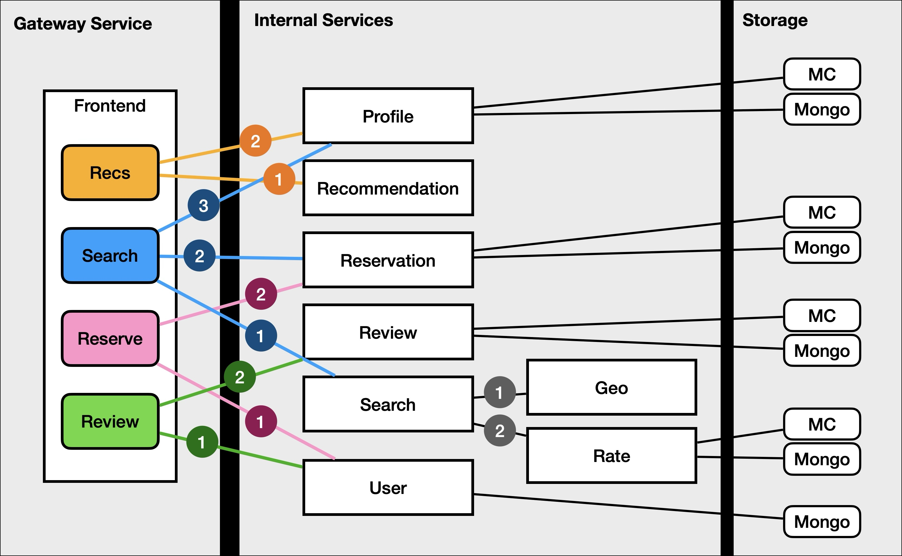

# Hotel Application

This is our port of the hotel application from the DeathStarBench suite.

The visualization below is the hotel application's call graph. Each rectangular box is a microservice.

The frontend service includes a few colored, rounded boxes: they are public-facing functionalities exposed by the frontend service. The numbers on the call graph edges show the order in which a parent service invokes on the internal services.

Numbers are not included on the calls to memcached ("MC" in the plot) and Mongo: in all cases, a service first checks if its query result can be found in memcached, attempts Mongo if they are not found in memcached, and updates memcached with the results from Mongo.