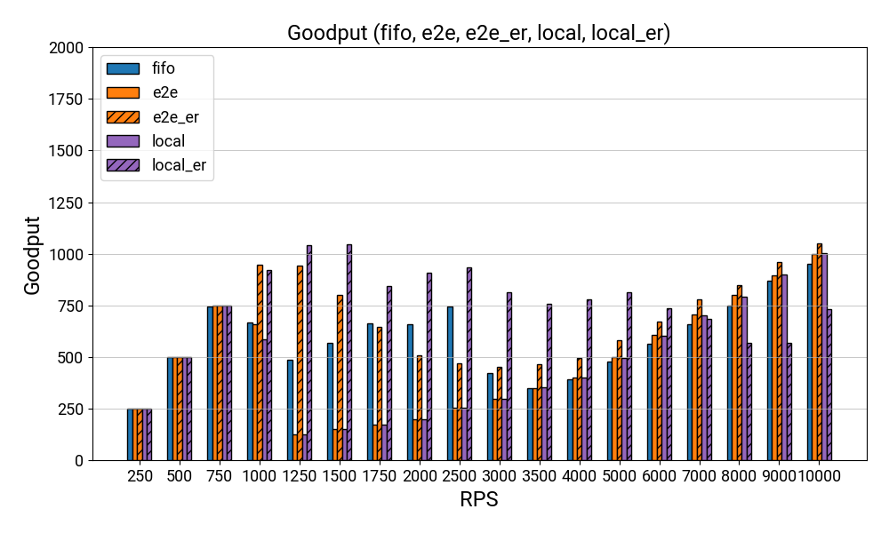
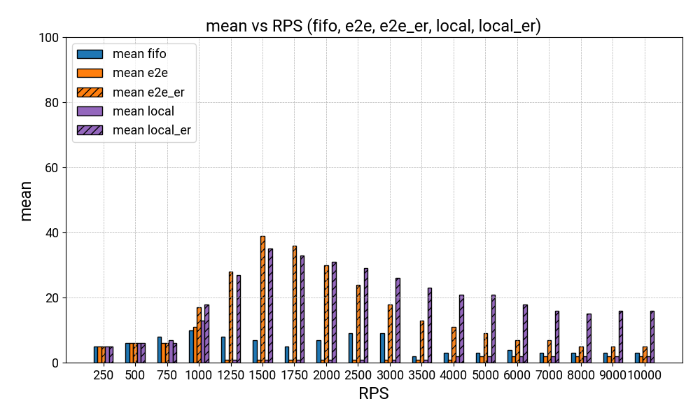
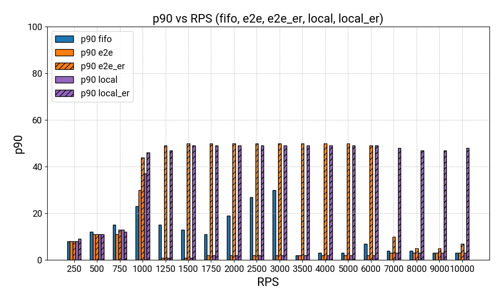
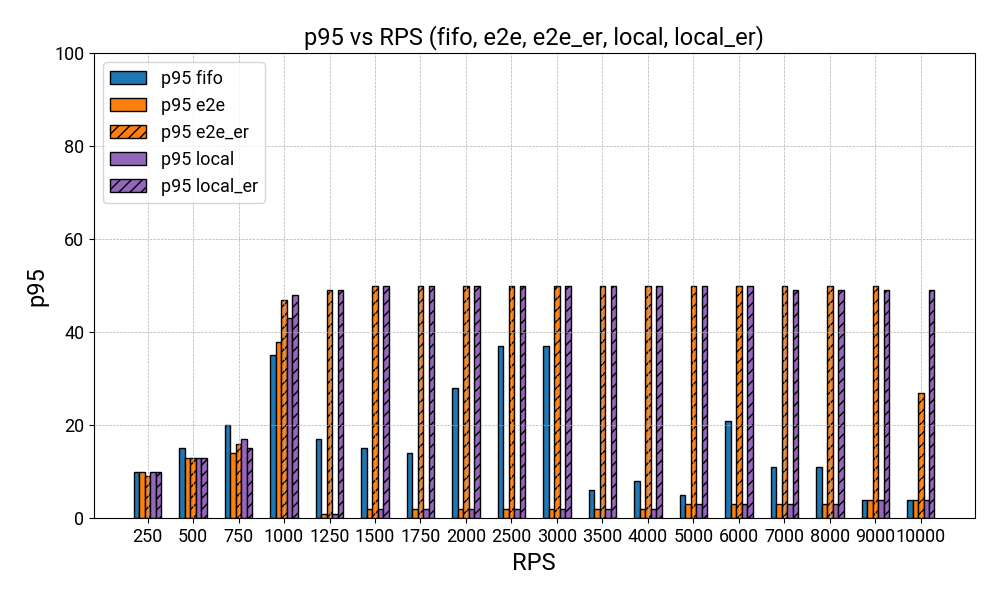
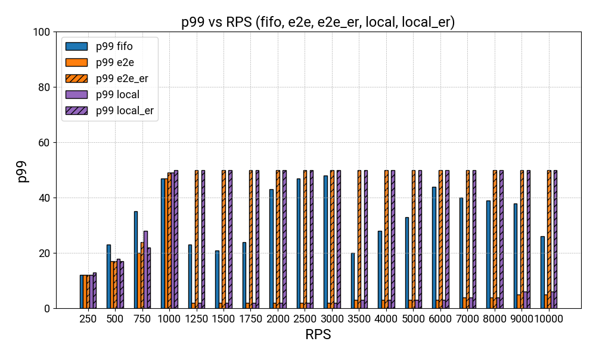
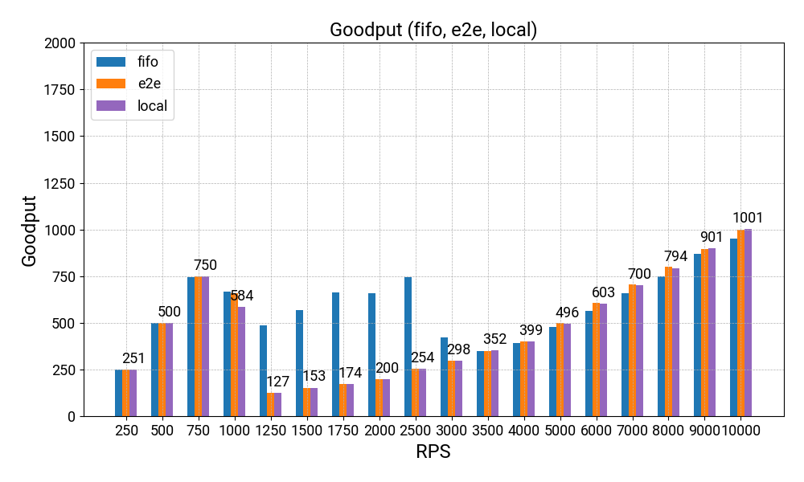
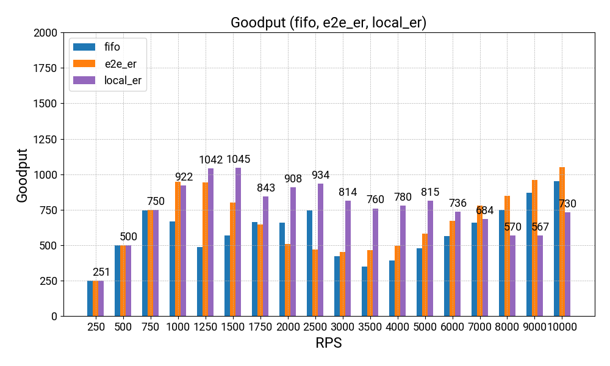
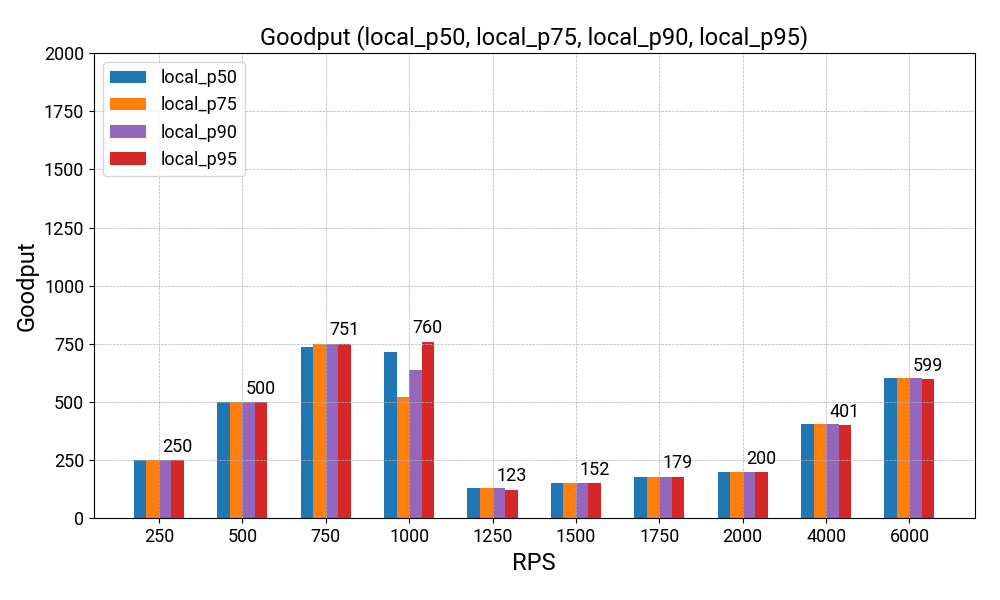
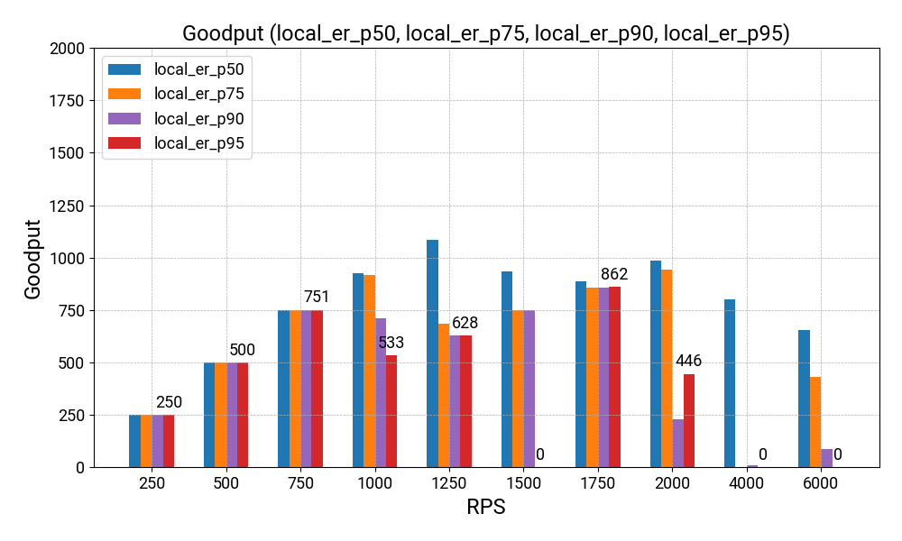

# README

Folder `search_reservation` runs `search:reservation=1:1` in one of `fifo`/`e2e`/`e2e_er`/`local`/`local_er`.

* `fifo`: Single FIFO queue for both normal and infra tasks.
* `e2e`: Priority queue using e2e deadlines.
* `e2e_er`: `e2e` plus early return.
* `local`: Priority queue using local deadlines/latest_exec_at.
* `local_er`: `local` plus early return.

[TODO:LD]: We should use different percentiles for local deadlines and latest_exec_at.

## Ongoing

## Done

