# README

Folder `single` runs one of `search`/`reservation` in one of `fifo`/`e2e`/`e2e_er`.

* `fifo`: Single FIFO queue for both normal and infra tasks.
* `e2e`: Priority queue using e2e deadlines.
* `e2e_er`: `e2e` plus early return.

## Search

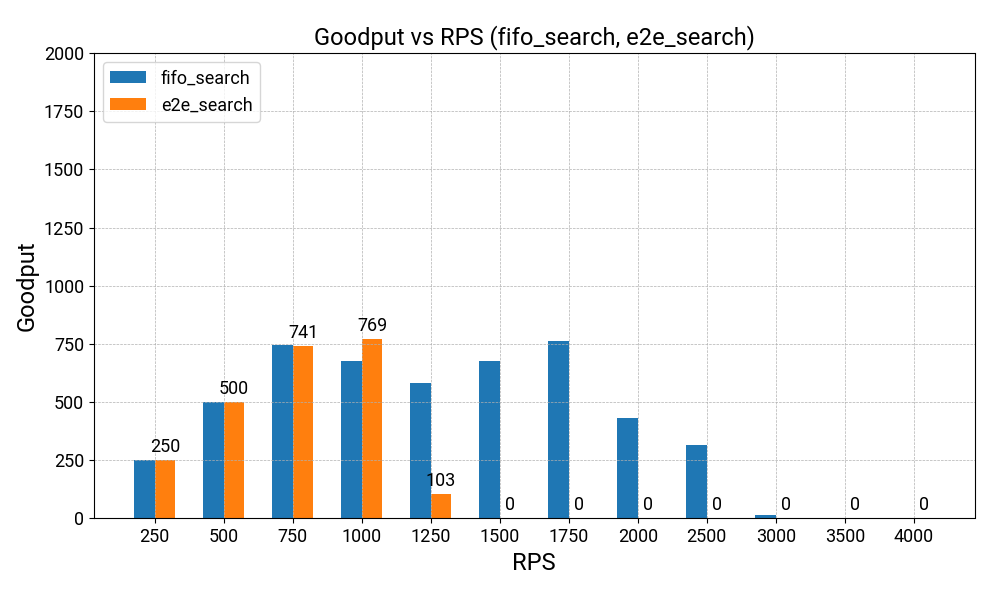
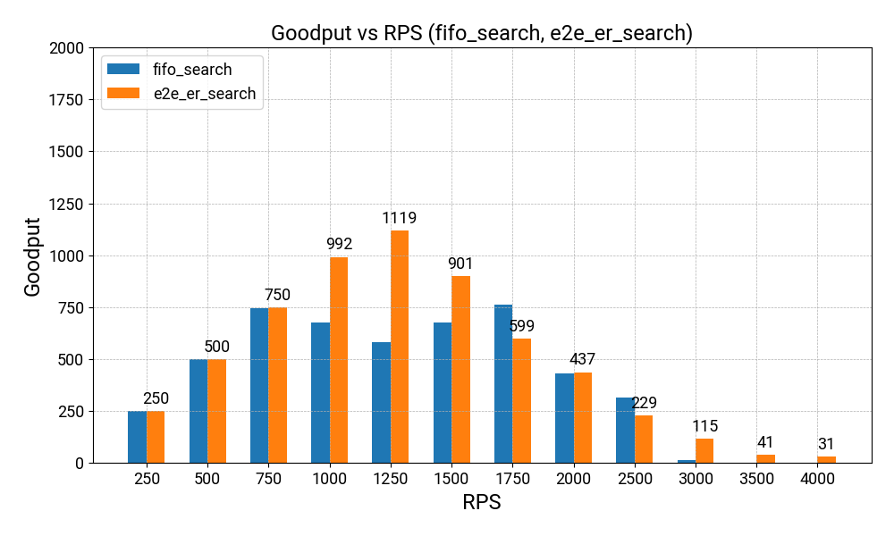
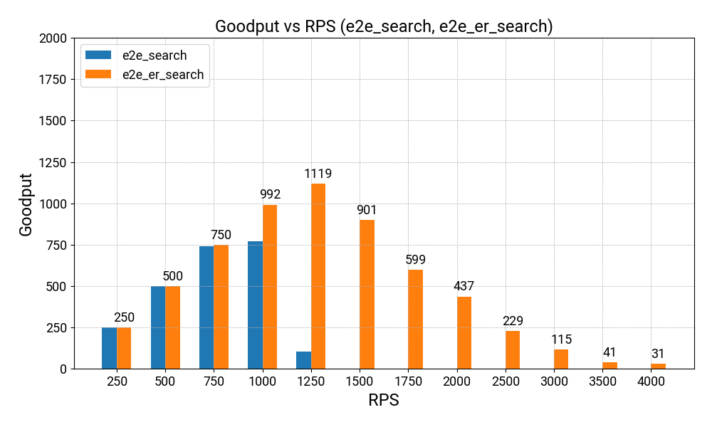
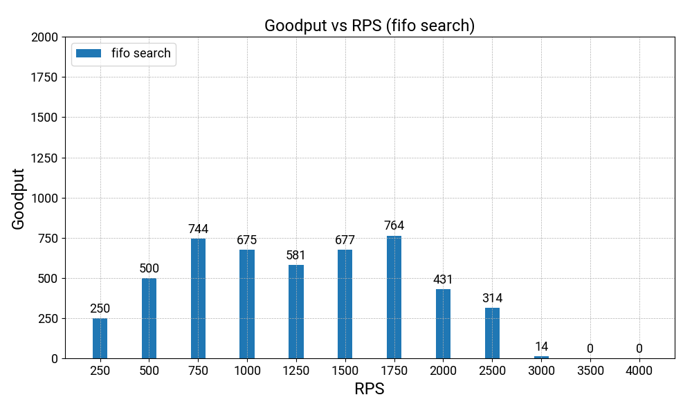
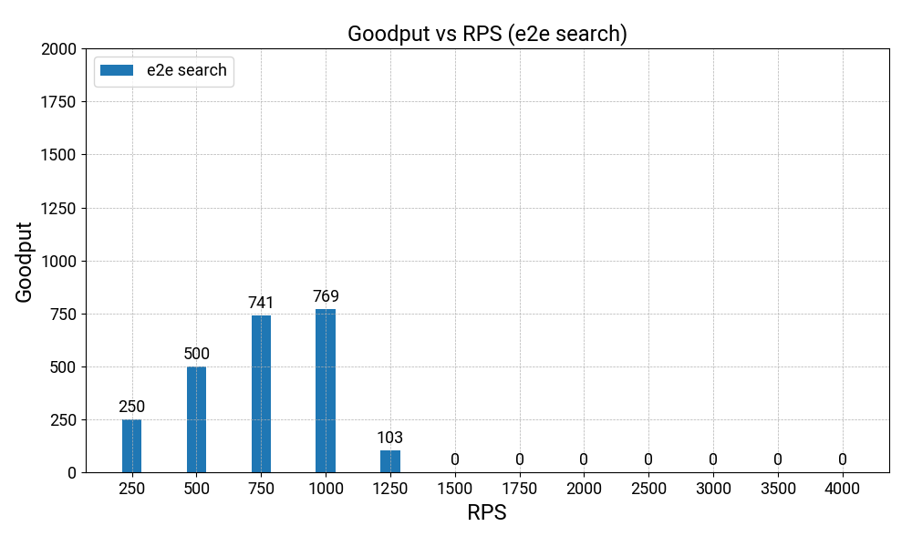
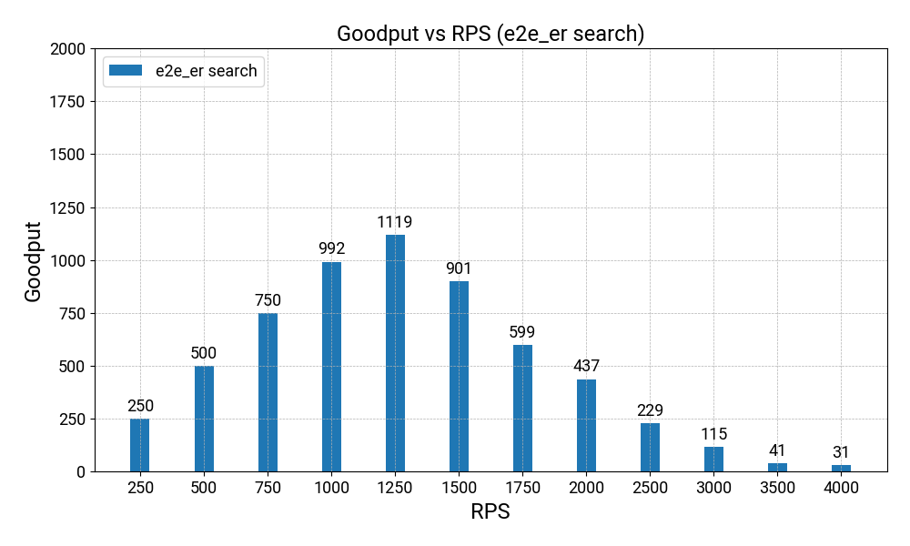

## Reservation

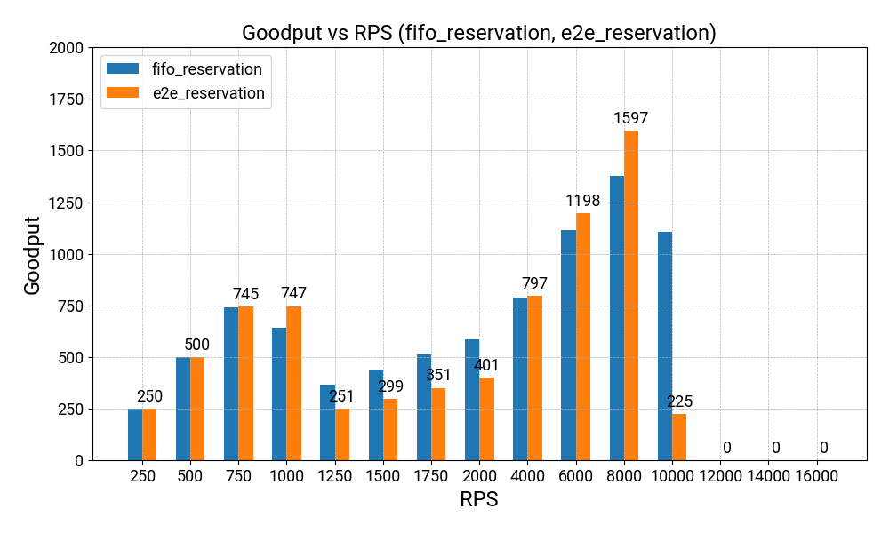
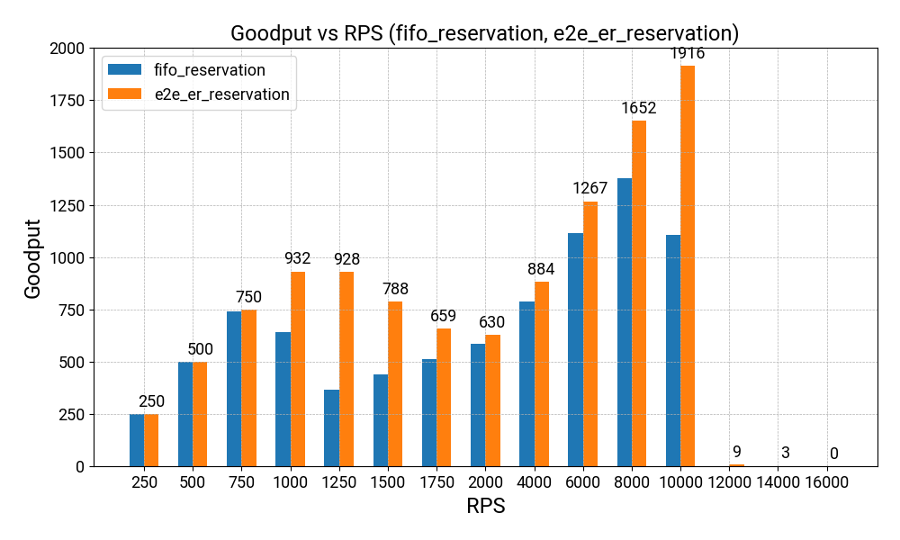
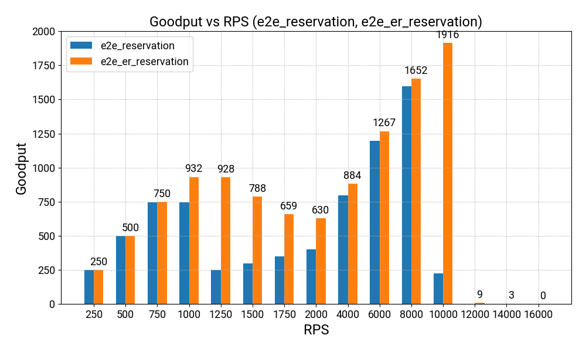
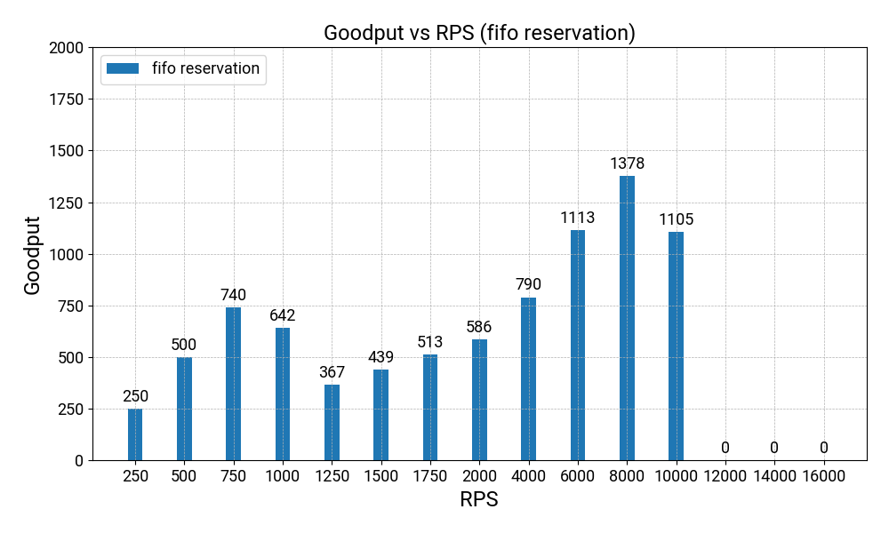
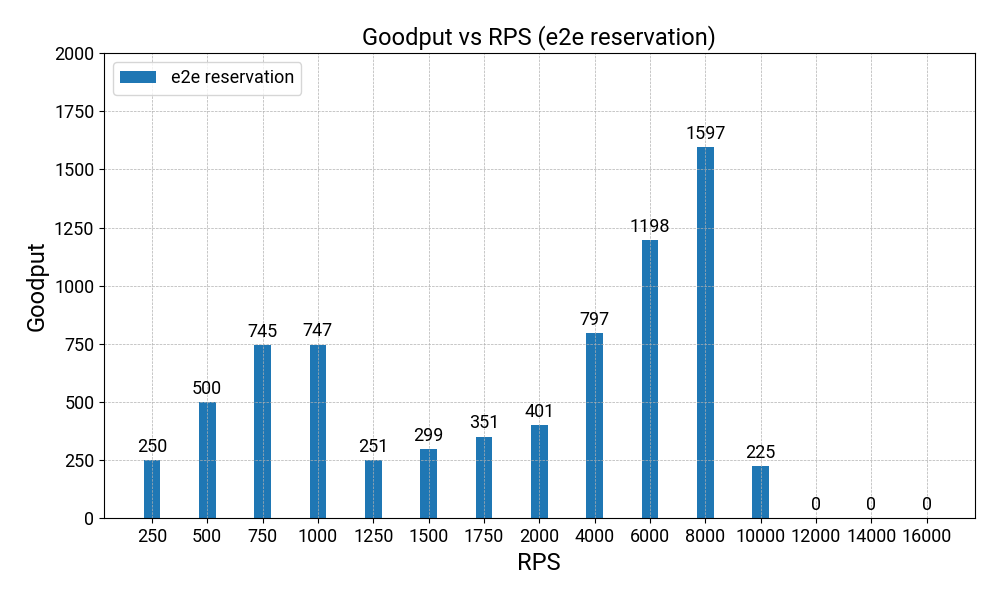
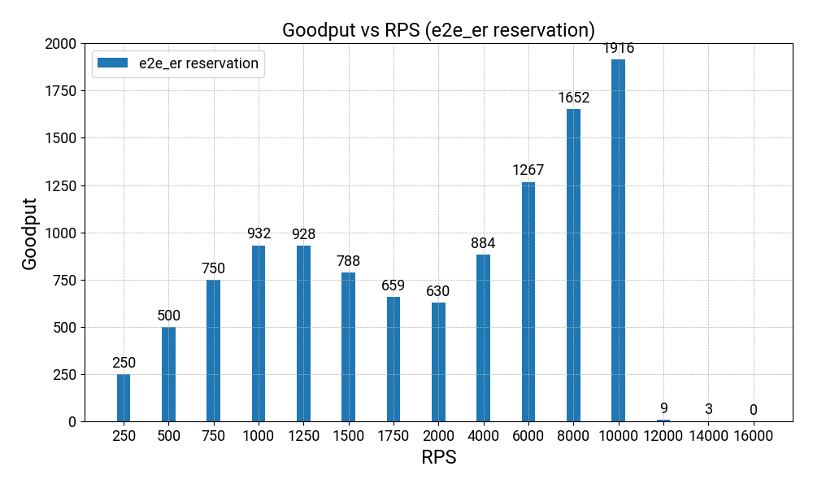
